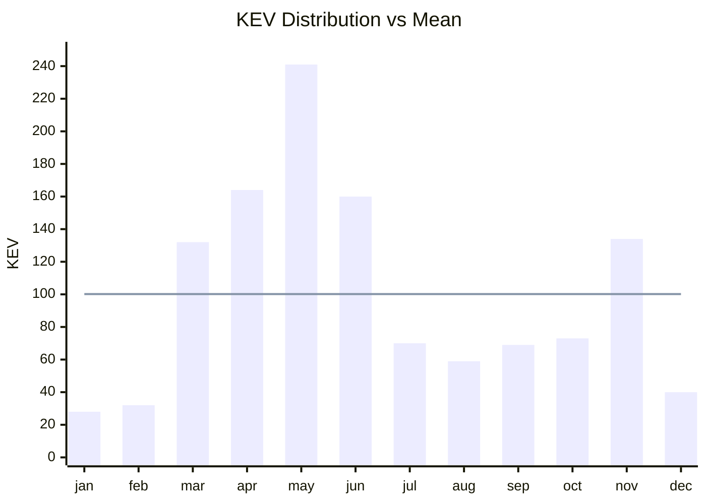

# CISA KEV (36M)

```mermaid
xychart
    title "KEV Distribution vs Mean"
    x-axis [jan, feb, mar, apr, may, jun, jul, aug, sep, oct, nov, dec]
    y-axis "KEV" 0 --> 250
    bar [28, 32, 132, 164, 241, 160, 70, 59, 69, 73, 134, 40]
    line [100.16, 100.16, 100.16, 100.16, 100.16, 100.16, 100.16, 100.16, 100.16, 100.16, 100.16, 100.16]

```

Jan	Feb	Mar	Apr	May	Jun	Jul	Aug	Sep	Oct	Nov	Dec
28	32	132	164	241	160	70	59	69	73	134	40
