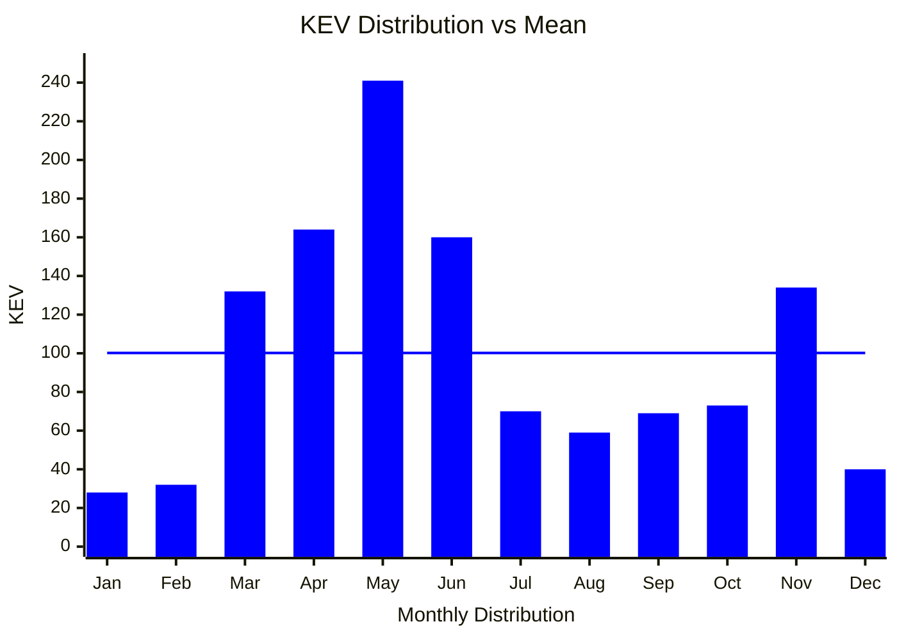

# CISA KEV (36M)

```mermaid
---
config:
  themeVariables:
    xyChart:
      showDataLabel: true
      plotColorPalette: '#0000FF, #0000FF, #0000FF, #FF0000, #0000FF'
---
xychart
    title "KEV Distribution vs Mean"
    x-axis "Monthly Distribution" [Jan, Feb, Mar, Apr, May, Jun, Jul, Aug, Sep, Oct, Nov, Dec]
    y-axis "KEV" 0 --> 250
    bar [28, 32, 132, 164, 241, 160, 70, 59, 69, 73, 134, 40]
    line [100.16, 100.16, 100.16, 100.16, 100.16, 100.16, 100.16, 100.16, 100.16, 100.16, 100.16, 100.16]

```

